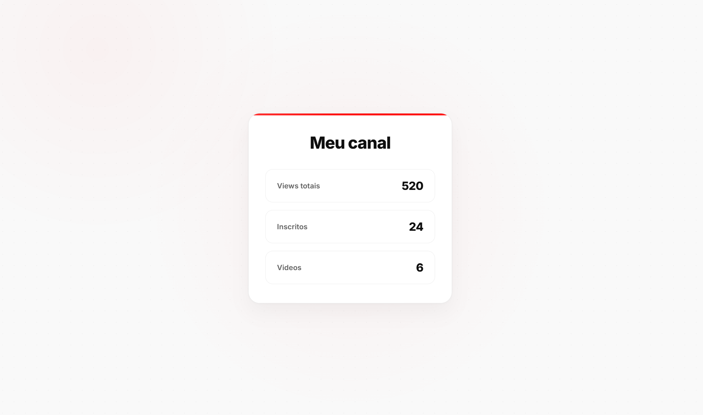

# 📺 YouTube Channel Stats

Uma aplicação web simples e responsiva desenvolvida em React.js + Vite que consome a API do YouTube para exibir métricas e informações de canais em tempo real.

---

## 📸 Preview do Projeto

Abaixo você pode conferir a interface principal do projeto exibindo os dados carregados dinamicamente:



---

## 🚀 Funcionalidades

* 👥 **Contador de inscritos** atualizado em tempo real.
* 👀 **Total de visualizações** acumuladas pelo canal.
* 🎥 **Contagem total de vídeos** públicos publicados.
* 🔍 **Busca customizada** inserindo o ID do canal desejado.

## 🛠️ Tecnologias Utilizadas

O ecossistema do projeto conta com as seguintes ferramentas:

* [React.js](https://reactjs.org/) — Biblioteca para construção de interfaces.
* [Vite](https://vitejs.dev/) — Bundler rápido e moderno para o ecossistema frontend.
* [JavaScript (ES6+)](https://developer.mozilla.org/pt-BR/docs/Web/JavaScript) — Linguagem de programação.
* [CSS3](https://developer.mozilla.org/pt-BR/docs/Web/CSS) — Estilização moderna e layout responsivo.
* [YouTube Data API v3](https://developers.google.com/youtube/v3) — API oficial da Google para consulta de dados.

---

## 🔑 Configuração das Credenciais

Para que o projeto funcione corretamente, você precisará de uma chave de API do Google Cloud Console.

1. Crie um arquivo `.env` na raiz do seu projeto.
2. Adicione sua chave da API do YouTube seguindo o padrão do Vite:

```env
VITE_YOUTUBE_API_KEY=SUA_CHAVE_AQUI

```

> 🔒 **Nota de Segurança:** A API Key utilizada foi devidamente restringida no painel do Google Cloud (HTTP referrers / restrições de API) para prevenir uso indevido por terceiros.

---

## ⚙️ Como Executar o Projeto

Siga os passos abaixo para rodar a aplicação localmente:

```bash
# 1. Clone o repositório
git clone <url-do-repositorio>

# 2. Acesse o diretório do projeto
cd nome-do-projeto

# 3. Instale todas as dependências necessárias
npm install

# 4. Inicie o servidor de desenvolvimento
npm run dev

```

Após iniciar, o Vite irá disponibilizar um endereço local (geralmente `http://localhost:5173`). Abra-o no seu navegador de preferência.

---

## 📚 Aprendizados Obtidos

Este projeto foi desenvolvido com foco educacional, servindo para solidificar conceitos práticos como:

* **Consumo Assíncrono de APIs:** Utilização do método nativo `fetch()`.
* **React Hooks:** Gerenciamento de ciclo de vida e efeitos colaterais com `useEffect` e controle de dados dinâmicos com `useState`.
* **Manipulação de Estados:** Fluxo de dados e renderização condicional baseada na resposta de requisições JSON.

---

## 👨‍💻 Autor

Desenvolvido com ☕ por **Lucas**.
